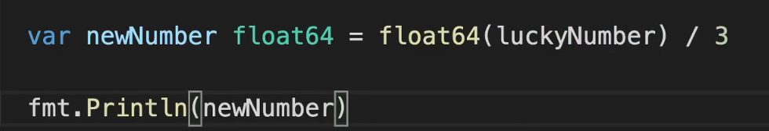

# Basics

go compliers run main func when executed.

go adds a semi-collon ; after every line where it ends.

---

### Variables and values

All operations needs values.

Variables are containers for values.

variable naming convention → use mixed or camel cases, no space or dash -

Data type must be defined. (go is statically typed language)

Three ways to define variables:

```go
//1
firstName := "Milind"
//2
var lastName string = "Dethe"
//3
var age int
age = 21
```

### Floats

float64 is used.

luckyNumber is an INT and needs to change in float64 before assigning it to a new var of FLOAT64 



Variable with **constant value** can be defined with `const`. its value cannot be change, if changed error will occur.

```go
const pi = 3.14 
```

---

# Modules and packages

| **Feature** | **Package** | **Module** |
| --- | --- | --- |
| Purpose | Organizes related code | Groups packages for release and versioning |
| Composition | Code files (e.g., `.go`) | Package files and `go.mod` file |
| Identifier | Package path | Module path |
| Dependencies | Not explicitly managed | Managed by `go.mod` file |

Go code files with same package can inter use the variables and func.

To import package into code use : `import {module_path}/{package_name}`

# Functions

```go
//nothing returns
func something(){
	fmt.Print("Hi")
}
//something is return
func something(n int) int{
	sq := n * n
	return sq
}
//something is return (named) already naming the return var 
func something(n int) (sq int){
	//no need of making var
	sq = n * n
	//just return (no var name)
	return 
}
//GO can return multiple values
//something is return (named) already naming the return var 
func something(n int) (sq int , cube int){
	sq = n * n
	cube = sq * n
	//just return (no var name)
	return 
}
```