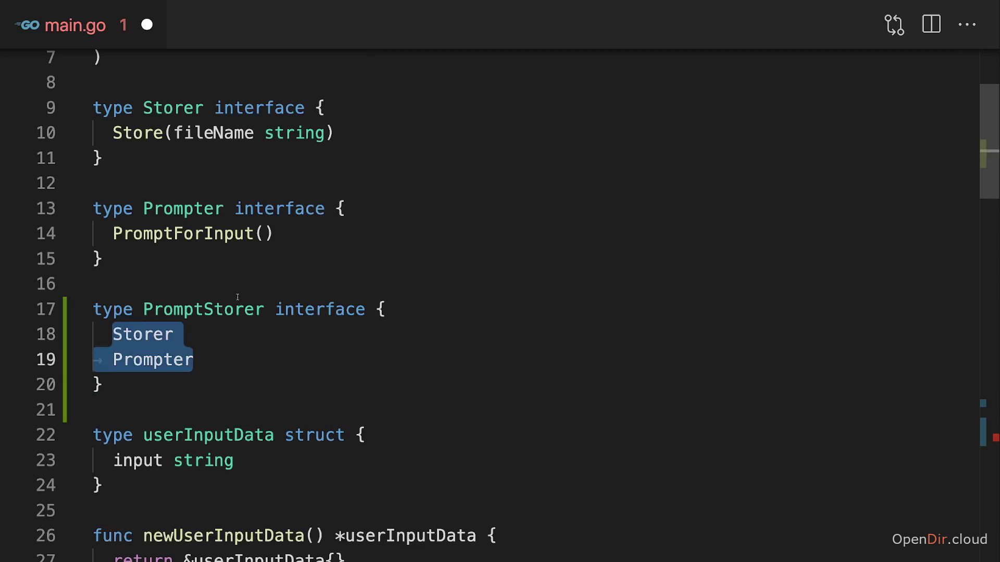

# Interfaces

interfaces are like contract.

if types has some common methods, they can be made a interface type which can used in func to apply that methods on them.

## Empty interface

it make data type to have no common methods, so it makes all types to be that interface.

in func, params can be any type. though logic in func should work with that type

```go
func print(value interface{}){
	fmt.Println(value)
}
```

---

## Embedding:

merging multiple interfaces/structs to one.



---

merging structs can be useful to get methods of other structs.